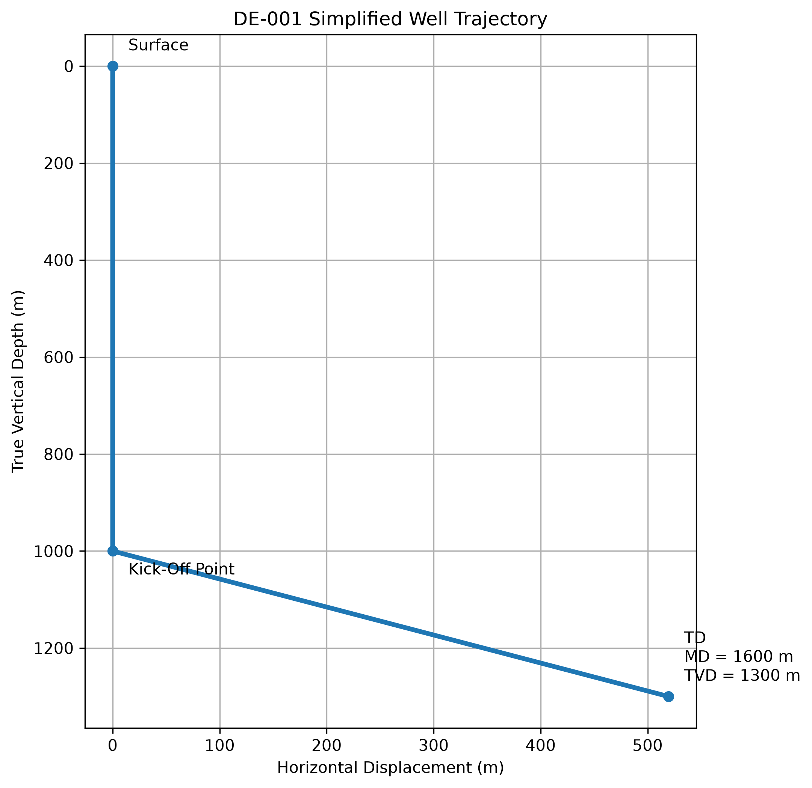
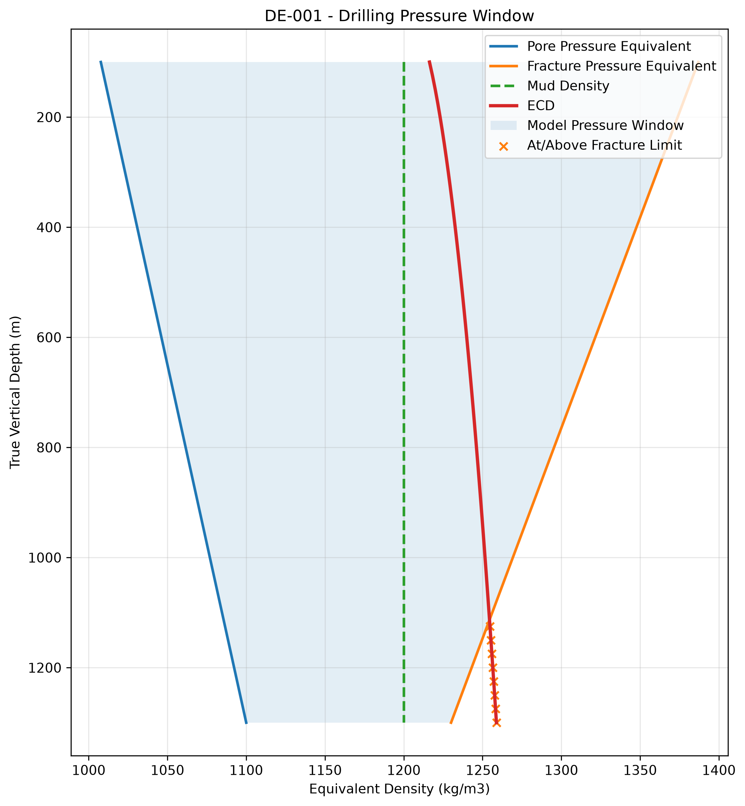

# Drilling Engineering Lab

### A self-directed Drilling Engineering Portfolio

**Mechanical Engineering | Drilling & Wells | Python | Engineering Visualisation**

This repository documents my journey in developing drilling engineering knowledge through self-directed learning, engineering calculations, Python programming, and technical visualisation.

My objective is to strengthen my knowledge of well engineering, drilling operations, downhole tools, and drilling performance as I work towards a technical career in drilling and well engineering.

The projects focus on translating engineering theory into practical calculation tools, simulations, and visualisations.

---

## Project 01: Well Architecture & Drilling Pressure Window

This project introduces fundamental drilling engineering concepts, including:

- Measured Depth (MD) and True Vertical Depth (TVD)
- Well inclination and horizontal displacement
- Hydrostatic pressure
- Circulating bottomhole pressure
- Equivalent Circulating Density (ECD)
- Pore pressure and fracture pressure
- Drilling pressure window
- Engineering calculations using Python

All data are synthetic and used for educational purposes.

---

## 1. Well Trajectory Visualisation

The first Python programme calculates the geometry of a simplified directional well.

### Engineering Inputs

| Parameter | Value |
|---|---:|
| Well name | DE-001 |
| Vertical section | 1,000 m |
| Inclined section | 600 m |
| Inclination | 60 degrees |
| Total MD | 1,600 m |
| Final TVD | 1,300 m |

### Engineering Equations

Measured Depth:

MD = Vertical Section + Inclined Section

True Vertical Depth:

TVD = Vertical Section + Inclined Length × cos(Inclination)

Horizontal displacement:

HD = Inclined Length × sin(Inclination)

### Generated Visualisation

The visualisation demonstrates the relationship between measured depth, true vertical depth, inclination, and horizontal displacement.

The model assumes a straight vertical section followed by a straight inclined section. It does not represent a realistic curved build section.

**Python file:** [visualize_well.py](01-well-architecture/visualize_well.py)

---

## 2. Hydrostatic Pressure & ECD Calculator

The second part of the project calculates static and circulating bottomhole pressure.

### Engineering Inputs

| Parameter | Value |
|---|---:|
| TVD | 1,300 m |
| Mud density | 1,200 kg/m3 |
| Annular friction | 0.75 MPa |
| Pore-pressure equivalent | 1,100 kg/m3 |
| Fracture-pressure equivalent | 1,230 kg/m3 |

### Engineering Equations

Static hydrostatic pressure:

P = rho × g × TVD

Circulating bottomhole pressure:

BHP = Hydrostatic Pressure + Annular Friction Pressure

Equivalent Circulating Density:

ECD = BHP / (g × TVD)

### Engineering Results

| Parameter | Result |
|---|---:|
| Static BHP | 15.30 MPa |
| Circulating BHP | 16.05 MPa |
| ECD | 1,258.81 kg/m3 |
| Fracture margin | -28.81 kg/m3 |

The model demonstrates how annular friction increases circulating bottomhole pressure and ECD without changing the actual mud density.

**Python file:** [well_depth_calculator.py](01-well-architecture/well_depth_calculator.py)

---

## 3. Drilling Pressure Window

The third part of the project visualises the relationship between pore pressure, fracture pressure, static mud density, and ECD over depth.

### Generated Visualisation

### Engineering Interpretation

The synthetic pressure profiles demonstrate a narrowing drilling pressure window with increasing depth.

At total depth, the calculated ECD exceeds the assumed fracture-pressure equivalent.

This indicates a potential mud-losses condition in the simplified circulating model.

The project illustrates why drilling engineers must consider circulating pressure, rather than relying only on static mud density.

**Python file:** [pressure_window_plot.py](01-well-architecture/pressure_window_plot.py)

---

## 4. Engineering Learning Outcomes

Through this project, I have practised:

- Applying engineering equations using Python
- Converting pressure units between Pa and MPa
- Calculating MD, TVD, and horizontal displacement
- Calculating static and circulating bottomhole pressure
- Understanding the relationship between annular friction and ECD
- Comparing ECD against assumed pore- and fracture-pressure limits
- Performing scenario and sensitivity calculations
- Visualising engineering results using Matplotlib
- Using basic validation checks to identify calculation inconsistencies

---

## 5. Tools & Technologies

| Tool | Application |
|---|---|
| Python | Engineering calculations |
| Matplotlib | Engineering visualisation |
| GitHub | Version control and portfolio |
| VS Code / Codespaces | Development environment |

---

## 6. Project Limitations

This project uses simplified engineering assumptions and synthetic data.

The calculations assume constant mud density, simplified well geometry, zero applied surface backpressure, and prescribed annular friction pressure.

The model does not account for all real-world drilling effects, including temperature variation, cuttings loading, pressure transients, formation uncertainty, or detailed wellbore hydraulics.

The pressure-window plots use illustrative synthetic formation-pressure profiles.

The calculations and graphs are intended for educational purposes only and must not be used for operational well design or drilling decisions.

---

## Future Projects

Planned learning areas include:

- Directional drilling and minimum-curvature calculations
- Interactive 3D well trajectory
- Bottom Hole Assembly (BHA) engineering
- Drilling hydraulics and hole cleaning
- Mechanical Specific Energy (MSE)
- Torque and drag
- Drilling performance analysis
- Casing and cementing calculations
- Drilling operations dashboards

---

*This repository is an ongoing self-directed learning project documenting my development in drilling and well engineering.*